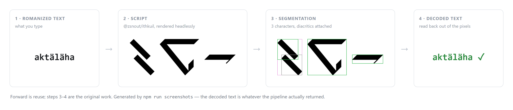
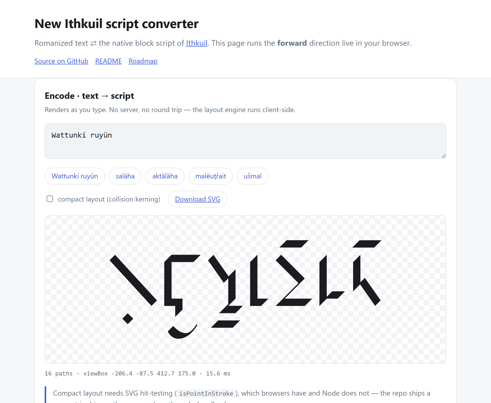
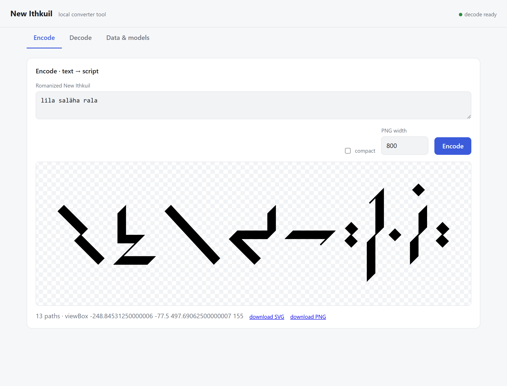
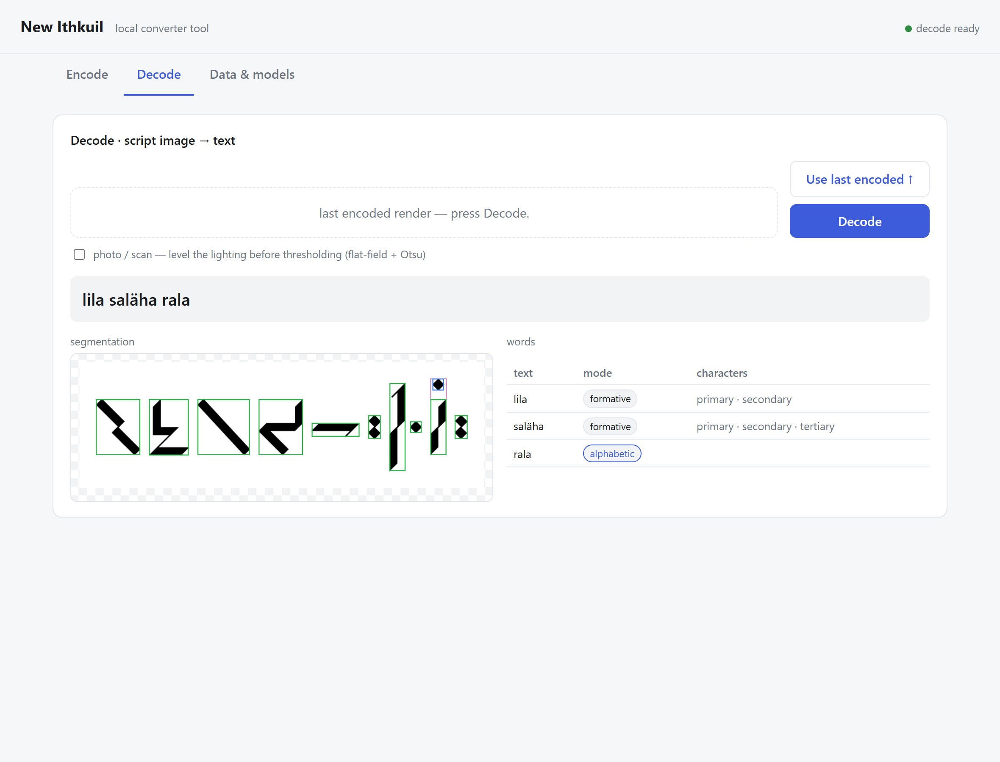
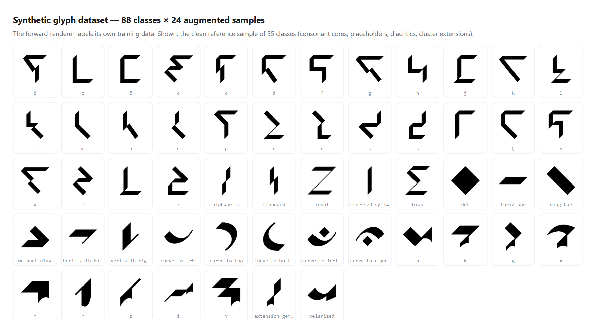
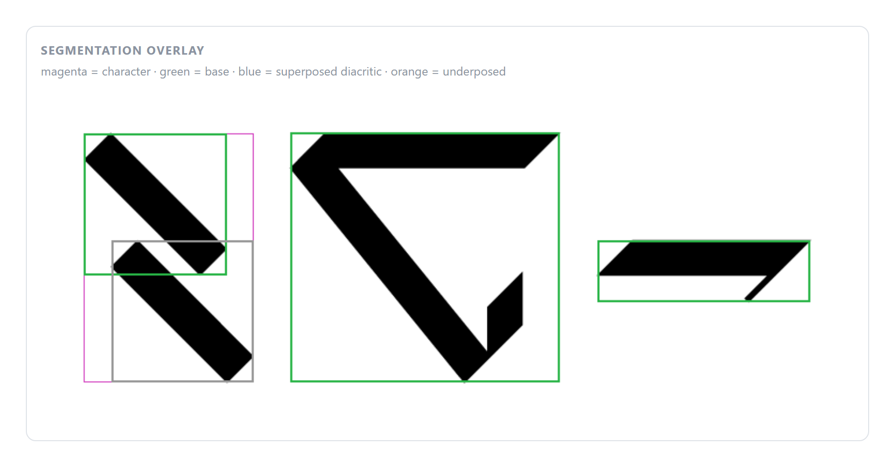
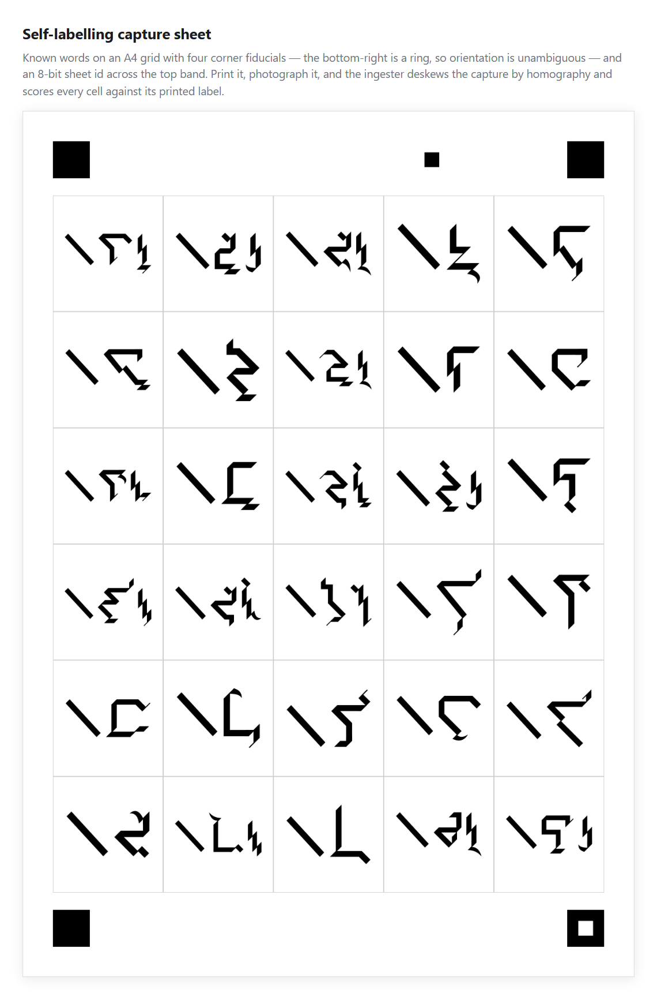

# Ithkuil script converter

**Romanized text → the native block script of [Ithkuil](https://ithkuil.net), and back out
of an image again.** The forward direction is reuse; the reverse direction — reading the
script out of pixels — is the part nothing else does, and is what this repository is for.

[](https://github.com/Dimitriuses/ithkuil-converter/actions/workflows/ci.yml)
[](https://github.com/Dimitriuses/ithkuil-converter/actions/workflows/pages.yml)
[](https://www.typescriptlang.org/)
[](https://nodejs.org)
[](LICENSE)
[](ROADMAP.md)

**[▶ Live demo](https://dimitriuses.github.io/ithkuil-converter/)** — type romanized New
Ithkuil, watch the script assemble in your browser.



That figure is generated by `npm run screenshots`, which runs the real pipeline — the text
in panel 4 is whatever the decoder actually returned, not a mock-up.

---

## What it is

Ithkuil's script is not an alphabet. A single character stacks a consonant core with up to
two extension consonants and carries diacritics above, below and beside it, and a word's
grammatical categories are distributed across several character types (primary, secondary,
tertiary, quaternary) that look nothing alike. So "OCR" here is less about recognising
shapes than about **reconstructing a valid word from a stream of composed glyphs**.

- **Forward — text → script.** Reuses [`@zsnout/ithkuil`](https://github.com/zsakowitz/ithkuil)
  (MIT), which composes the script algorithmically. No font was built or reverse-engineered:
  it is a solved problem, and the effort belongs elsewhere.
- **Synthetic data — for free.** The same renderer labels its own training data. Every glyph
  class is rendered clean plus augmented, which is where the templates and the CNN training
  sets come from. No hand-labelling anywhere in the project.
- **Reverse — script → text.** Binarize → segment into characters (attaching each diacritic
  to its base) → classify each character's *type* → route to a per-type decoder → reassemble
  the features into a formative → romanize it through `@zsnout`'s generator. Classification
  is thickness-invariant Chamfer template matching, with five small CNNs layered on top for
  the cases template matching provably cannot separate.
- **Real paper.** A print-and-rescan loop closes the gap to actual photographs: sheets of
  known words with corner fiducials and a self-describing sheet id, deskewed by homography
  and scored cell by cell against their printed labels.

## Results

Every number is reproducible from a clean checkout; the command is the citation.

| Benchmark | With CNNs trained | Templates only | Command |
| --- | --- | --- | --- |
| **Real-vocabulary round trip** (4,387 roots, frequency-weighted) | **92.6%** | 42.6% | `npm run lexicon-test -- 50` |
| Alphabetic-register spelling (character level) | 100% | 94.6% | `npm run alphabetic` |
| Printed, photographed, decoded | 78.1% | — | `npm run scan-test` |
| Feature regression gate (spec × Vn × root) | 46/48 | **48/48** | `npm run word-test` |
| Multi-word phrases | 7/7 | **7/7** | `npm run phrase-test` |
| Case (Vc), all 68 cases | 100% | **100%** | `npm run case-test` |
| Tertiary / quaternary / secondary characters | — | 100% / 95.1% / 97.0% | `npm run tertiary-test` … |

Two things that table is deliberately explicit about:

- **The CNNs are opt-in and matter enormously.** They are tens of MB, so they are not
  committed; a fresh clone decodes on template matching alone at **42.6%** on real
  vocabulary, and `npm run setup -- --with-models` (a couple of hours on CPU) is what buys
  the 92.6%. CI gates the template-only column, because CI trains nothing.
- **`word-test`'s 48/48 is not an accuracy claim.** Its roots are short and hand-picked so
  that a change to one feature shows up in isolation. Measured against the real lexicon the
  same pipeline once scored 23.5% while that harness read 100% — which is how the honest
  benchmark came to exist. See [KNOWNISSUES.md](KNOWNISSUES.md).

## Try it

**In the browser:** the [live demo](https://dimitriuses.github.io/ithkuil-converter/) runs
the forward path with no install — it renders as you type, and gets compact collision kerning
for free because a browser has the SVG hit-testing that Node needs a shim for. It cannot
decode; that needs the local pipeline.



**Locally**, with [Node](https://nodejs.org) ≥ 18 (22 recommended). No Python or C++
toolchain: the one native dependency ships a prebuilt binary and repairs itself on Windows.

```bash
git clone https://github.com/Dimitriuses/ithkuil-converter
cd ithkuil-converter/new-ithkuil-2023

npm run setup      # provisions and verifies everything (~25 min once)
npm run serve      # → http://localhost:3939
```

`npm run setup` is idempotent — it is installer, repair tool and verifier in one, and every
step is guarded so re-running only does what is missing. To inspect an existing checkout
without changing anything:

```bash
npm run doctor     # readiness report; exits non-zero if something required is missing
```

<details>
<summary>What setup actually does, and why it takes that long</summary>

1. **Dependencies** — `npm install`, whose `postinstall` places the native `tfjs-node`
   shared library next to its addon (the Windows "error 126" fix).
2. **Native backend** — verifies `@tensorflow/tfjs-node` loads. Hard requirement: the decode
   pipeline imports the CNN loaders statically.
3. **Glyph template dataset** — renders 2,112 labelled samples across 88 classes (~10 min).
   Gitignored, so a fresh clone always builds it.
4. **Reverse-decode caches** — pre-renders ~1,200 alphabetic base templates (~8 min) so the
   first real request is not slow. Everything is cached to disk with a version stamp.
5. **Verification** — runs the composed-word round trip end to end. If it passes, the
   system works.

The four-figure render count is the cost: every template is a real rasterization. It is
paid once and cached.
</details>

## Using it

### The local web tool



Three tabs over the same core the CLI uses: **Encode** (text → SVG + PNG), **Decode**
(upload a PNG or a phone JPEG → text, with a segmentation overlay), and **Data & models**,
which runs dataset generation, cache builds, CNN training and the test harnesses as tracked
background jobs with live logs. Encode is ready instantly; decode warms its caches in the
background.



The words table is the interesting part: word boundaries are recovered *structurally* — each
formative is primary-initial — and a word the language spells phonetically instead is
detected as an alphabetic-register span and decoded by a different path.

### The command line

```bash
npm run encode -- "saläha"                    # SVG to stdout
npm run encode -- "saläha" -o word.svg --png word.png -w 1200
```

### As a library

The pipeline is plain TypeScript modules with no framework:

```ts
import { encode } from "./src/forward.js"          // text  → SVG
import { svgToPng } from "./src/raster.js"         // SVG   → PNG
import { binarize, segment } from "./src/segment.js"
import { decodePhrase } from "./src/decode-word.js" // image → text

const svg = encode("lila saläha rala")
```

## How it works



```
FORWARD   text ─parse→ word JSON ─script→ SVG ─resvg→ PNG
                                     │
SYNTHETIC │ the same renderer labels its own training data
                                     ▼
REVERSE   image ─binarize→ segment → char-type → per-type decoders → features
                                                    ─@zsnout/generate→ text
```

The reverse pipeline targets the **word JSON structure**, not free-form romanization —
`@zsnout` turns JSON into text, so the recognizer's job shrinks to "image → structured
characters", which is a far smaller target than "image → correct spelling".



Segmentation is where the script's structure pays off: characters are separated by clear
horizontal gaps, and a diacritic's x-range always falls inside its base character's — so
connected components merged by x-overlap give characters, and vertical position then tags
each component as base, superposed or underposed.

Layout, all under `new-ithkuil-2023/src/`:

| Area | Files |
| --- | --- |
| Forward | `forward.ts`, `dom-shim.ts`, `raster.ts`, `cli.ts` |
| Segmentation & imaging | `segment.ts`, `image-io.ts`, `normalize.ts`, `chamfer.ts` |
| Character decoders | `char-type.ts`, `primary.ts`, `secondary.ts`, `tertiary.ts`, `quaternary.ts`, `alphabetic.ts`, `case-vowel.ts` |
| Orchestration | `decode-word.ts`, `assemble.ts`, `decode.ts` |
| Classifiers | `classify.ts`, `cnn*.ts`, `*-cnn.ts`, `template-cache.ts` |
| Data generation | `generate-dataset.ts`, `glyph-classes.ts`, `glyph-render.ts`, `augment*.ts` |
| Real scans | `scan-sheet.ts`, `scan-ingest.ts`, `scan-layout.ts`, `scan-test.ts` |
| Tooling | `server.ts`, `jobs.ts`, `web/index.html`, `../demo/`, `../tools/` |

### Printed-page capture



`npm run scan-sheet -- 8` emits eight A4 sheets of 240 distinct lexicon-weighted words.
Photograph them however you like — rotation and perspective are fine, because the four
corner fiducials give a homography and the bottom-right ring fixes orientation — and
`npm run scan-ingest` deskews each capture onto the canonical frame while
`npm run scan-test` scores every cell against its printed label. The sheet carries its own
number as an 8-bit strip, so a capture named `20260716_185816.jpg` can never be scored
against the wrong manifest.

## Tests

```bash
npm run typecheck     # tsc --noEmit
npm test              # 64 unit tests, ~4 s, no dataset required
npm run demo:smoke    # drives the built demo page in headless Chromium (17 checks)
```

The unit suite uses Node's built-in test runner — no test framework dependency — and covers
the deterministic parts: segmentation and flat-field binarization, EXIF orientation, the SVG
path geometry behind compact kerning, shape normalization and the Chamfer metric, sheet
geometry, lexicon sampling, and the forward path's failure modes.

The round-trip harnesses are the integration tier. Each prints its numbers **and exits
non-zero below a floor**, so CI can gate them:

```
$ npm run tertiary-test
tertiary round-trip: 81/81 full = 100.0%
  valence 100.0%  ·  absLevel 100.0%  ·  relLevel 100.0%
  PASS  tertiary: 81/81 = 100.0%  (floor 98%)
```

CI runs typecheck and the unit suite on **Ubuntu and Windows**, builds and browser-tests the
demo, runs seven gated round-trip harnesses against a freshly generated dataset, and lints
the 2011 Python scripts.

## Roadmap and limitations

[**ROADMAP.md**](ROADMAP.md) — what is next, what has been ruled out and why. The short
version: the frontier is real photographs (78.1%), and the last ~7% of the lexicon is
diagnosed down to individual letter pairs with four failed remedies documented so they are
not retried.

[**KNOWNISSUES.md**](KNOWNISSUES.md) — measured limits. In brief: one line of script at a
time; the demo is forward-only; the web tool is localhost-only with no auth; a fresh clone
needs ~25 minutes of provisioning; `npm audit` reports four unfixable install-time
advisories inside `@tensorflow/tfjs-node`; and the 2011 analysis needs a font you supply
yourself — see [NOTICE.md](NOTICE.md).

## The 2011 sub-project

[`ithkuil-2011/`](ithkuil-2011/) is a **completed, separate** analysis of the OpenType font
that encodes the older 2004–2011 Ithkuil script: extract its tables, rebuild the codepoint →
character-class model, and validate every glyph against the published reference figures.
Verdict: faithful wherever a reference exists (primary 24/24, tertiary 7/7), two genuine
discrepancies, ~55 glyphs with no isolated reference. Written up in
[`ithkuil-validation-report.md`](ithkuil-2011/ithkuil-validation-report.md).

It shares **no code and no assets** with the active project — the 2011 script and New
Ithkuil are different writing systems with different character types and different phoneme
inventories. It is kept as a reference, as the origin of the Chamfer matching harness the
reverse pipeline still uses, and as the prior art for [building a New Ithkuil font](ROADMAP.md).

**The font itself is not in this repository.** It is third-party and its licence forbids
redistribution, which covers the glyph outlines extracted from it — so the outlines are gone
too, and the analysis scripts exit with an explanatory error until you supply your own copy.
The findings are unaffected: the report, the encoding audit, the 114 validation verdicts and
every mapping table are measurements, not artwork. [NOTICE.md](NOTICE.md) records exactly
what was removed and what stayed.

## Contributing

Issues and pull requests are welcome. [`CLAUDE.md`](CLAUDE.md) documents the architecture,
the commands and the invariants that are easy to break quietly;
[`new-ithkuil-2023/roadmap.md`](new-ithkuil-2023/roadmap.md) is the full engineering log,
including every approach that was measured and rejected — worth a look before proposing one.

## Licence

[MIT](LICENSE) for this repository's own code and documentation. Third-party components keep
their own terms, including one that is **not** compatible with redistribution — all recorded
in [NOTICE.md](NOTICE.md).

Ithkuil itself, and both writing systems, are the work of **John Quijada**
([ithkuil.net](https://ithkuil.net)). The forward renderer is
[`@zsnout/ithkuil`](https://github.com/zsakowitz/ithkuil) by sakawi.
